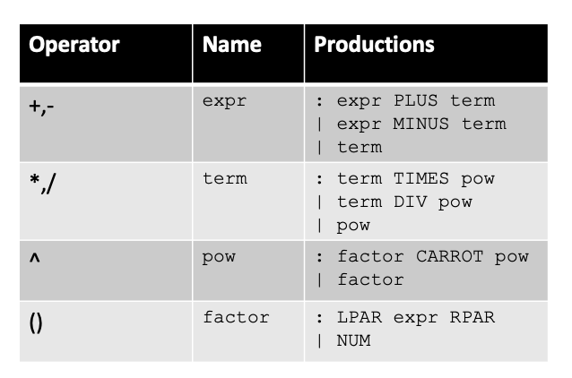

# Day 8

## BNF

Bacus-Naur form

### Example

```
add_expr ::= NUM '+' NUM
```

Terminals are either string constants or tokens . Tokens will be all caps.

### RE

Any RE can be expressed in BNF.

#### Concat

```
add_expr ::= NUM '+' NUM
```

#### Choice

```
simple_expr ::= NUM ‘+’ NUM
            | NUM ‘*’ NUM
```

#### Star

```
a_star ::= ""
       | "a"
       | "a" a_star
```

### Post-order Traversal

AKA natural traversal. Left to right, bottom to top.

## Richer Grammars

Go from top to bottom in the table by using non-terminals to represent the different levels of the grammar. By allowing each rule to evaluate to NUM if nothing else matches, we can encode order of operations into the grammar.


```

```
