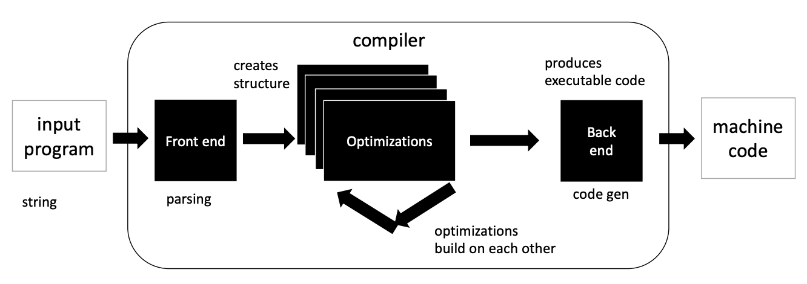
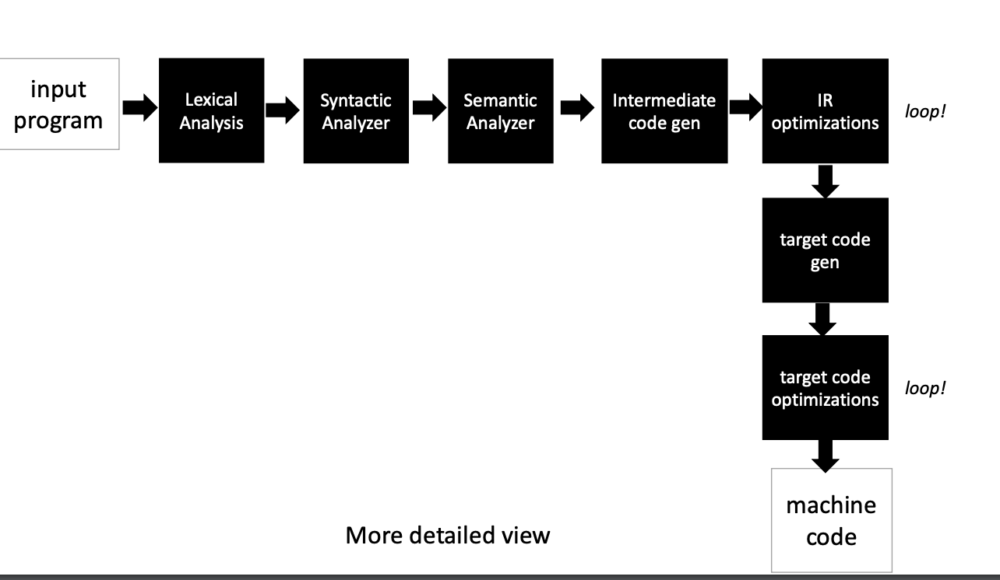

# What is a Compiler

## Announcements

- Homework 1 released monday
- Piazza is up
- Coming soon:
  - TA and tutor office hours

### Office Hours

- Room E2 233
- Sign up sheet around noon tomorrow

## Quiz

### Compiler Features

### Why do we take this class?

- Reverse engineering
- Better software engineer
- take away magic
- write more performant code
- Theory of programming languages

## What is a Compiler?

Essentially it takes in one language and turns it into another.

## GCC and Clang

### Similarities and Differences

Clang goes from C/C++ to LLVM IR while GCC goes directly from C/C++ to assembly

GCC is able to compile linux while Clang can't really perfectly compile linux

Both GCC and Clang extend C/C++ with their own technical rules such as how GCC always initializes variables to 0.

## Semantic Equivalence

A **valid** input must have an equivalent **valid** output.

---

If you write a program in C then it is required for any compiler to reproduce the same meaning in the output assembly code.

That is the purpose of the C specification; to unambiguously define the meaning of a C program.

## Warnings

Warnings will not fully prevent the compilation of a program but they often point out potential areas for bugs and common programmer pitfalls.

---

Example:

```c
int foo() {
  int x; // x is uninitialized
  int y = x;
  return y;
}
```

## Errors

C allows for certain incorrect programs to compile but might throw errors at runtime.

## Optimizations

the `-O3` flag tells the compiler that it can take as much time as it wants to optimize the code to make it run faster.

## Functionally

Regarding the output of the function. As long as the output of a function is the same then the compiler is functioning correctly.

## Non-Functionally

Timing, memory usage, etc. Any side-effect that is not the strict output of the function.

## Iterative Compilation



## Compilation Pipeline Overview


