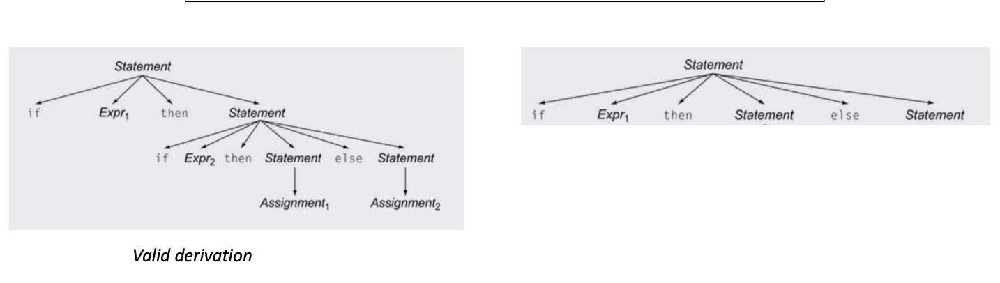

# Day 7

## Announcements

Start of module two which gets more complex with recursion.

## Quiz

### Q1

Which of the following are token actions NOT great for:

- Changing the value of a token
- Changing the token type
- **Splitting a token into multiple tokens**
- Keeping track of scanning statistics

### Q2

Which of the following naguage features make scanner implementations easier?

- [x] Rexular expression matcher
- [x] Higher order functions
- [x] Types
- [ ] Interpreted languages

### Q3

All scanner generators have the same interface, which makes it very easy to switch from one generator (e.g. Lex) to another (e.g. PLY).

- True
- **False** - They have similar interfaces but not exactly the same.

### Q4

If you were given a scanner that you knew was either an EM Scanner, SOS Scanner, or NG scanner, and you could instantiate it with any token definitions you want, could you design an experiment (without using timing information) to determine which scanner implementation you had?

You can have a token with the regex
`+|++` to determine between the EM and SOS scanner. If it matches `++` then it is an EM scanner otherwise if it matches `+` twice it is an SOS scanner.

Similarly you can use two tokens to distinguish between the SOS and NG Scanner.

```
T1 = `+`
T2 = `++`
```

Because the NG scanner will go in order of matches it will match T1 twice whereas SOS will match all of the regexes against the input string and then return the longest match meaning it will match T2.

## Syntactic Analysis

Determines if tokens fit into the syntactic structure of the language.

### Context-free Languages

A context free language is a language that can be recognized by a context-free grammar.

### Context-free Grammar

We will use Backus-Naur Form (BNF) to define the grammar of a language.

```
add_expr ::= NUM '+' NUM

mult_expr ::= NUM '*' NUM

joint_expr ::= add_expr '*' add_expr

simple_expr ::= NUM `+` NUM
            | NUM '*' NUM
```

An example to match algebraic expressions.

```
1: Expr ::= ‘(’ Expr ‘)’
2:      | Expr Op ID
3:      | ID
4: Op   ::= ‘+’
5: Op   | ‘*’
```

Two types of rules: terminal and non-terminal. Terminals will either be string constants or tokens.

### Ambiguous Grammar

When different derivations have different parse trees.

Example:

```bnf
1: Statement ::= ”if” Expr “then” Statement “else” Statement
2:           | ”if” Expr “then” Statement
3:           | Assignment
4:           | ....
```

```
if Expr1 then if Expr2 then Assignment1 else Assignment2
```



#### Case Study

Using a Context-Free Grammar you can derive random strings in a language.

##### C-Smith

Generates random C programs and is used to test compiler correctness.

You can simply compare the output of random C programs compiled with different compilers to check for correctness. If there is a difference then you know at least one of the compilers has a consistency bug.